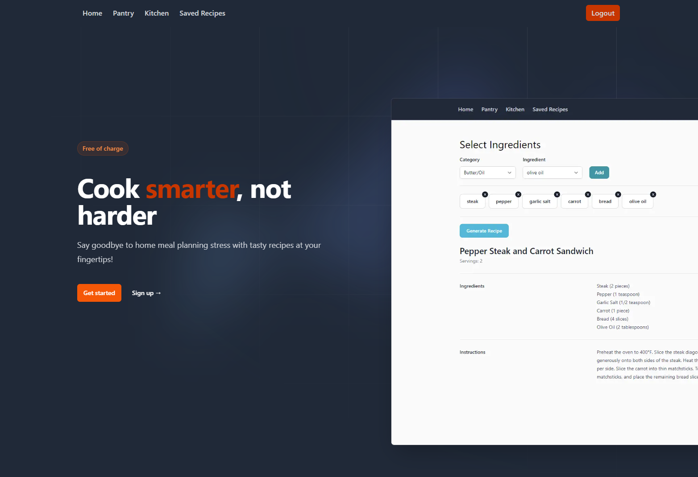

# I'm Hungry

A web application built with Next.js, React, JavaScript, and Tailwind CSS that helps users manage their pantry, generate recipes, and save and edit their favorite recipes.



# Usage

The "I'm Hungry" app allows users to perform the following actions:

- Sign Up: Create a new account with a unique username and password.
- Log In: Log in to the application using your credentials.
- Pantry: Add the food items you have in your pantry.
- Kitchen: Select ingredients from your pantry and generate a recipe using ChatGPT's AI.
- Saved Recipes: View all your saved recipes and make edits if needed.
- Folder Structure
  The project's folder structure is as follows:
  public: Contains public assets such as images.
  src: Contains the main source code for the application.
  components: Contains reusable components for the application's UI.
  db: Contains configuration files for MySQL and model schemas using Sequelize.
  pages: Contains the endpoint files for different pages.
  The `pages/api` directory is mapped to `/api/*`. Files in this directory are treated as [API routes](https://nextjs.org/docs/api-routes/introduction) instead of React pages.
  styles: Contains global CSS styles.
  utils: Contains utility middleware and functions.
  .env: Environment configuration file.

  Developers should pay attention to the following files and directories:
  src/components: Contains reusable UI components.
  src/db: Contains database configuration and model schemas.
  src/pages: Contains endpoint files for different pages.

You can check out our application demo following the youtube link!

[Youtube video link for demo usage of the web application](https://youtu.be/WdB640nxd3M)

# Key Features

Pantry Management: Users can add the food items they have into their pantry.
Recipe Generation: Users can select ingredients from their pantry and generate a recipe using ChatGPT's AI.
Saved Recipes: Users can view and edit their saved recipes.

# Technologies Used

The "I'm Hungry" app utilizes the following technologies, frameworks, and libraries:

- &#9745; Next.js
- &#9745; React
- &#9745; JavaScript
- &#9745; OpenAI API
- &#9745; JWT
- &#9745; Sequelize
- &#9745; Axios
- &#9745; MySQL
- &#9745; Tailwind CSS

# Installation

To run the application locally, follow these steps:

Open the terminal and navigate to the project directory.

Run the following command to install the dependencies:

- npm install

Add local env variables

- check out `.env.example` to see the env variables needed to run the app

Create mySQL db following the schema located in `src/db/schema`

Start the development server by running the following command:

- First, run the development server:

```bash
npm run dev
# or
yarn dev
# or
npm dev
```

Open [http://localhost:3000](http://localhost:3000) with your browser to access the application.

You can also check out the gif below to see how we start up our server!

[GIF showing user how to install dependencies and starting up the server](./public/images/readme.gif)

## Learn More

To learn more about Next.js, take a look at the following resources:

- [Next.js Documentation](https://nextjs.org/docs) - learn about Next.js features and API.
- [Learn Next.js](https://nextjs.org/learn) - an interactive Next.js tutorial.

# APIs

The application integrates with the following external API:

ChatGPT: Used to generate recipes. Please set up the following environment variables in your .env file:

API_KEY: Your ChatGPT API key.
API_ENDPOINT: The API endpoint for ChatGPT.
API_MODEL: The model to use for generating recipes.
API_ROLE: The role assigned to your ChatGPT API.

# Deployment

The application is already deployed on Heroku. If you would like to contribute, please create a pull request, and the owner will update the Heroku deployment with the changes.

# Future Improvements

Implement daily, weekly, and monthly meal plans.
Personalize meal plans based on dietary restrictions.
Allow scaling of recipes based on the number of servings.
Add a chatbox feature to interact with ChatGPT.
Enable recipe sharing on social media platforms.

# Contributing

Contributions to the project are welcome. If you would like to contribute, please follow these guidelines:

- Pull from the main branch before committing your code.
- Create a pull request
- Someone on the team will take a look at your code and then merge to main, along with updating Heroku with your changes.

# Licenses

MIT License
